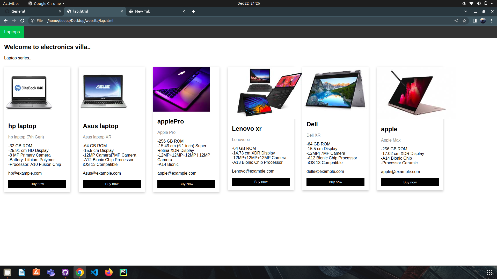

# E-Commerce _Website
 Ecommerce can be defined as the buying and selling of goods electronically online. Its popular because of the many benefits of e-business -internet marketing, electronic funds transfer, mobile commerce – this is broken up into two parts. Online retail shopping that goes directly to consumers through mobile apps, websites and even voice assistants, chats, chatbots etc. Sellers being a part of online marketplaces where many third-party sales take place.

 
   

   

  

   

  

   

  

   

  

   

This Ecoomerce website was made to help you know more about the benefits of e-business. The online marketplace is a good platform for you to expand your business. know i will going to explain what kind of advantages there are by sharing what we know about online selling. these are the plus points we will talk about.

1. Faster buying process
2. Store and product listing creation
3. Cost reduction
4. Affordable advertising and marketing
5. Flexibility for customers
6. No reach limitations
7. Product and price comparison
8. Faster response to buyer/market demands
9. Several payment modes
10. Enables easy exports

